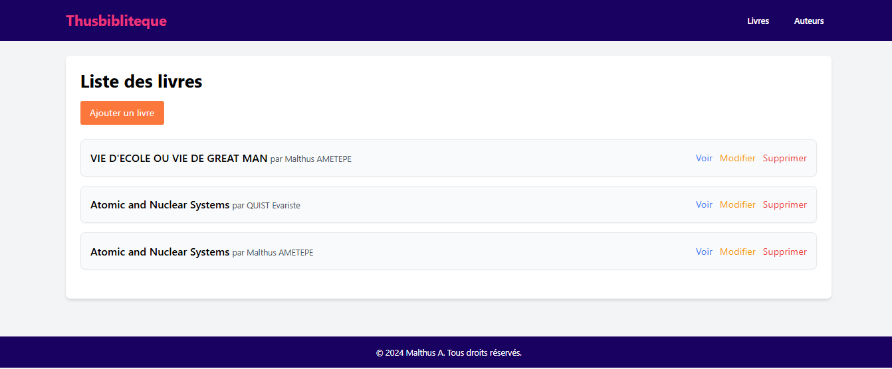
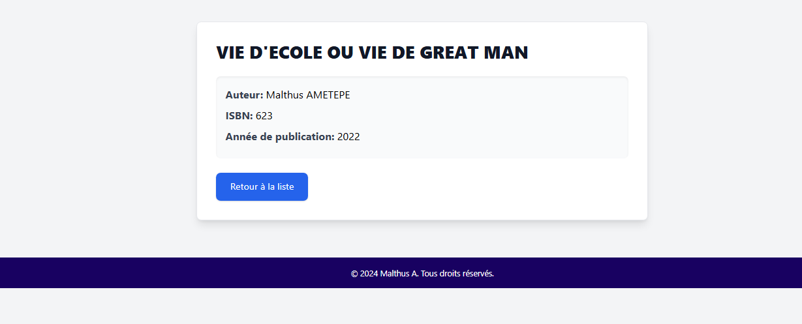
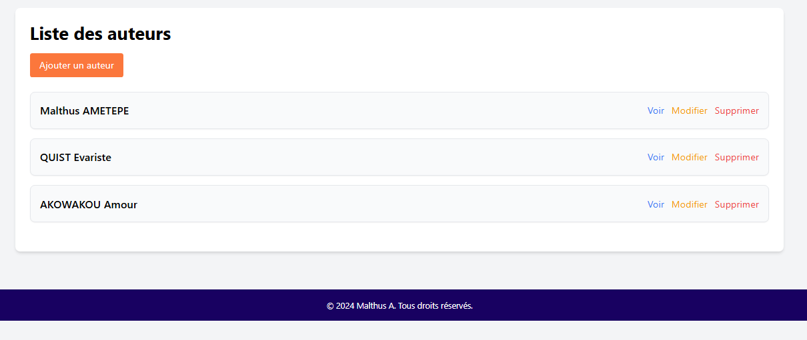
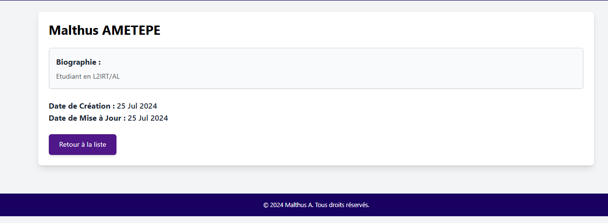

# Gestion de Bibliothèque

## Description

Ce projet est une application Laravel pour la gestion d'une bibliothèque. Il permet de gérer les livres et les auteurs, en offrant des fonctionnalités complètes de création, lecture, mise à jour et suppression (CRUD). Les utilisateurs peuvent associer des livres à des auteurs, et afficher des listes paginées.

# Fonctionnalités

- **Gestion des Livres :**
  - Ajouter, lire, mettre à jour et supprimer des livres.
  - Associer des livres à des auteurs.

- **Gestion des Auteurs :**
  - Ajouter, lire, mettre à jour et supprimer des auteurs.
  - Rechercher des auteurs par nom.

- **Interface Utilisateur :**
  - Interface moderne et responsive avec Tailwind CSS.
  - Pagination pour les listes de livres et d'auteurs.

## Prérequis

- PHP 8.0 
- Composer
- MySQL 
- Node.js et npm (pour les dépendances front-end)

## Installation

1. **Clonez le Repository :**

   git clone https://github.com/votre-utilisateur/votre-repository.git
   cd votre-repository
   

2. **Installez les Dépendances :**

   ```bash
   composer install
   npm install
   ```

3. **Configurez l'Environnement :**

Configuration des paramètres de la base de données
Pour configurer votre base de données :

Accédez au fichier .env

Ouvrez le fichier .env à la racine de votre projet.
Modifiez les paramètres de la base de données

DB_CONNECTION : Type de connexion (mysql, pgsql, etc.).
DB_HOST : Adresse du serveur de base de données.
DB_PORT : Port du serveur de base de données.
DB_DATABASE : Nom de la base de données.
DB_USERNAME : Nom d'utilisateur pour la connexion.
DB_PASSWORD : Mot de passe associé à l'utilisateur.
Assurez-vous que ces valeurs correspondent aux informations fournies par votre serveur de base de données.

4. **Générez la Clé d'Application :**

   ```bash
   php artisan key:generate
   ```

5. **Exécutez les Migrations :**

   ```bash
   php artisan migrate
   ```

6. **Compilez les Assets :**


   npm run dev

7. **Démarrez le Serveur :**

   php artisan serve

   Accédez à l'application à l'adresse [http://localhost:8000](http://localhost:8000).

## Captures d'Écran

### Page d'Accueil


### Liste des Livres



### Détail d'un Livre



### Liste des Auteurs



### Détail d'un Auteur



## Utilisation
vos aurais besoin de peu de connection pour cause du lien cdn tailwind.css utilser

- **Accéder à la Liste des Livres :** Cliquez sur "Livres" dans la barre de navigation.
- **Ajouter un Livre :** Cliquez sur "Ajouter un Livre" pour créer un nouveau livre.
- **Modifier un Livre :** Utilisez les liens "Modifier" dans la liste des livres pour éditer les détails.
- **Supprimer un Livre :** Utilisez les boutons "Supprimer" pour retirer un livre.
- **Rechercher :** Utilisez la barre de recherche pour filtrer les livres et les auteurs.

## Contribution

Les contributions sont les bienvenues. Veuillez soumettre un pull request pour toute amélioration ou correction. Assurez-vous de suivre les bonnes pratiques de développement et de tester vos modifications.

## License

Ce projet est sous licence [Malthus AMETEPE](LICENSE).

